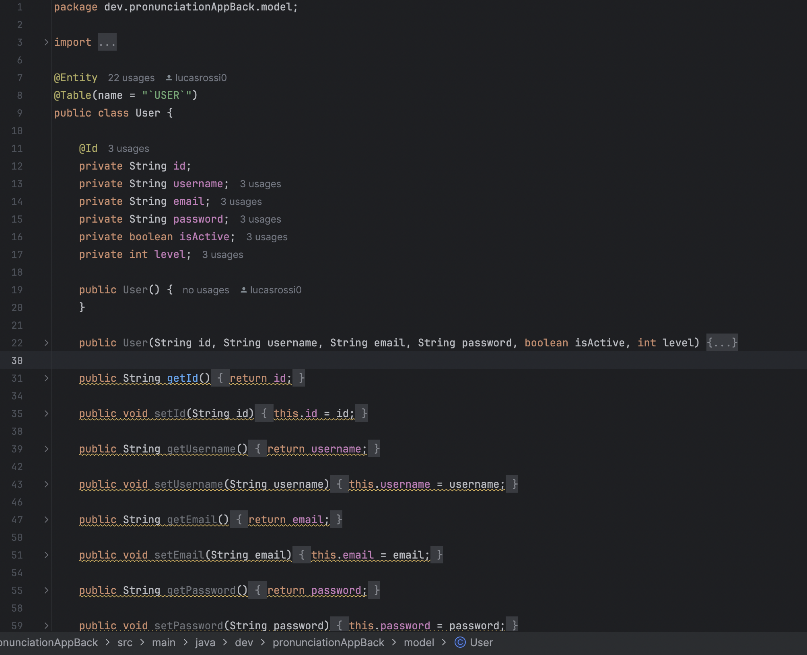
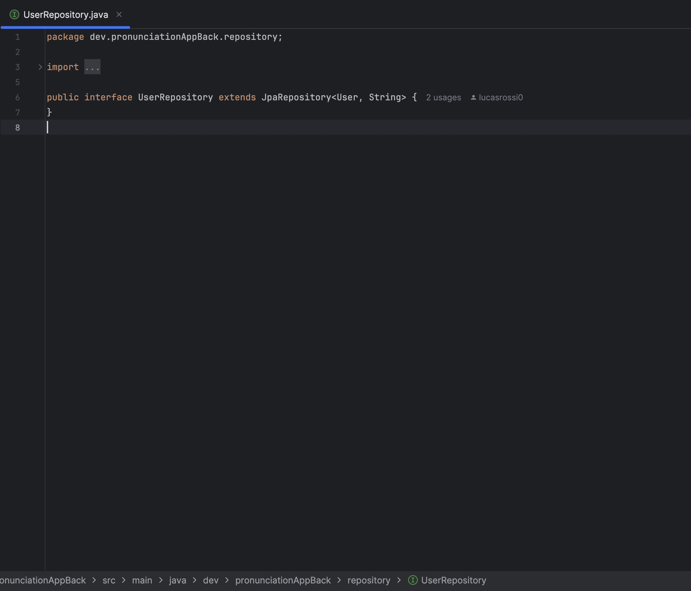
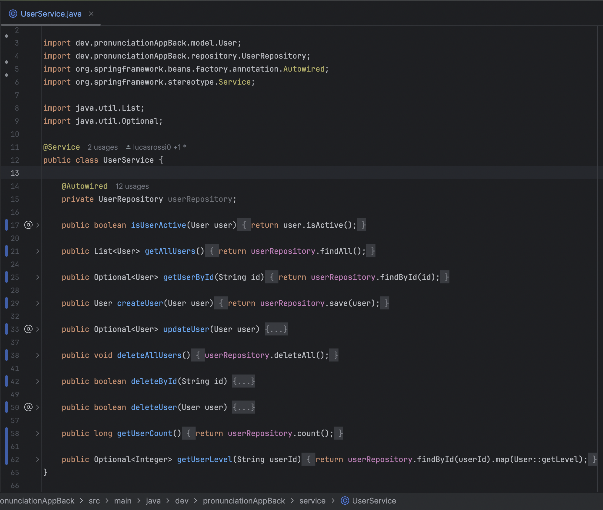
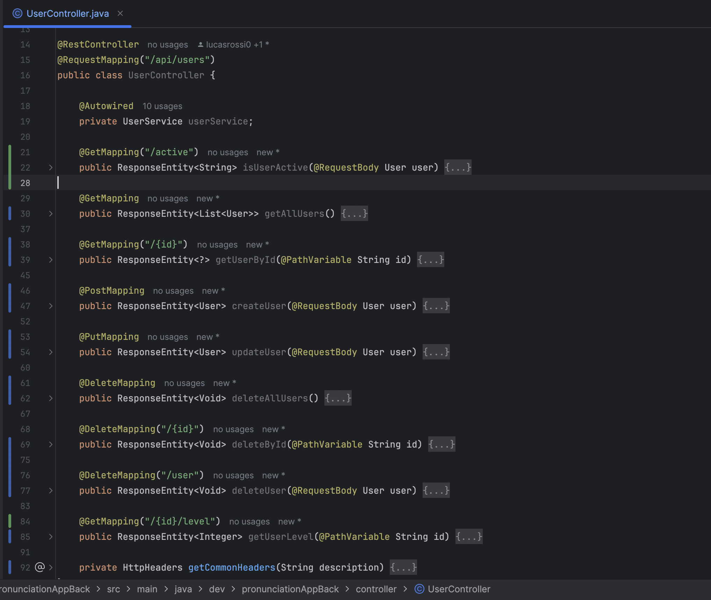
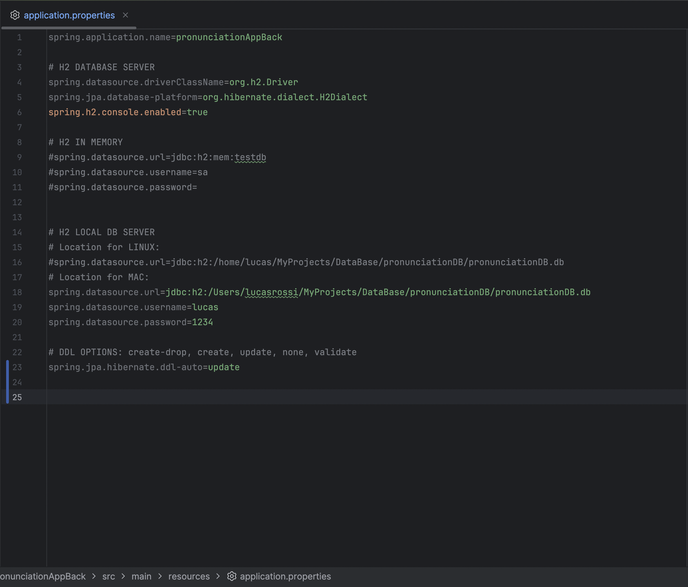

Tasks:
1- Create User Entity inside the model folder
2- create User Repository Interface inside the repository folder
3- Create User Service inside the service folder
4- Create User Controller inside the controller folder
5- Configure in application properties H2 database
6- Test endpoints
7- Make more queries for the bussiness logic

## PRA#02-SpringBoot: Create User API Rest

In this documentation, the steps taken for developing a Spring Boot REST API for user management are explained.

---

### 1 - Create User Entity

---

Created the User entity class in the model folder with all necessary attributes and annotations. The class uses JPA annotations for database mapping and includes validation constraints. Here's the structure:



---

### 2 - Create User Repository Interface

---

Implemented the UserRepository interface extending JpaRepository to handle database operations. The repository provides basic CRUD operations and custom queries:



---

### 3 - Create User Service

---

Developed the UserService class to handle business logic between the controller and repository layers. The service implements various operations including:



---

### 4 - Create User Controller

---

Implemented the REST controller to handle HTTP requests. The controller includes endpoints for all CRUD operations:



---

### 5 - Configure H2 Database

---

Set up the H2 database configuration in application.properties. I created two URLs depending on where I am working at:



---

### 6 - Additional Business Logic Queries

---

Implemented additional custom queries in the UserRepository to enhance business logic:

```java
public interface UserRepository extends JpaRepository<User, Long> {
    // Find users by email domain
    @Query("SELECT u FROM User u WHERE u.email LIKE %:domain%")
    List<User> findByEmailDomain(@Param("domain") String domain);

    // Find recently active users
    @Query("SELECT u FROM User u WHERE u.active = true AND u.createdAt > :date")
    List<User> findActiveUsersCreatedAfter(@Param("date") LocalDate date);

    // Count users by status
    long countByActiveTrue();
}
```

These queries were then utilized in the UserService to provide additional functionality:

```java
public class UserService {
    public List<User> getRecentActiveUsers(int days) {
        LocalDate cutoffDate = LocalDate.now().minusDays(days);
        return userRepository.findActiveUsersCreatedAfter(cutoffDate);
    }

    public List<User> getUsersByEmailDomain(String domain) {
        return userRepository.findByEmailDomain(domain);
    }
}
```

---

### Next Steps

The following tasks are planned for future development:

1. Implement comprehensive unit tests for the service layer
2. Create integration tests for the REST endpoints
3. Add data seeding functionality using Faker
4. Implement additional validation and error handling
5. Add documentation using Swagger/OpenAPI

The API is currently functional and supports all basic CRUD operations with proper validation and error handling.
